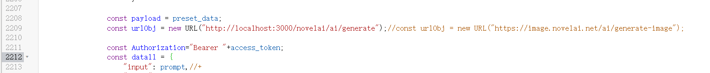

# nai3-proxy

Novel AI的代理服务器

中转NovelAI的代理服务器，要按照一个大佬的油猴插图脚本来进行使用，其代码2209行修改成这个中转的地址，开放端口为9945，写法为http://地址:3000/novelai/ai/generate

要下载node.js
可以使用start.bat来进行执行，或者命令行用node server.js
如果有代理了话，端口不是7890，需要修改server.js里面代理端口
开放的端口需要更改修改server.js里面最后面几行的端口。
命令行中会看到密钥,最好是本地运行程序
下载地址为:https://github.com/dreamsSoul/nai3-proxy.git
